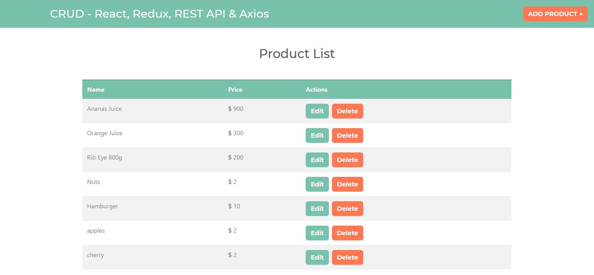
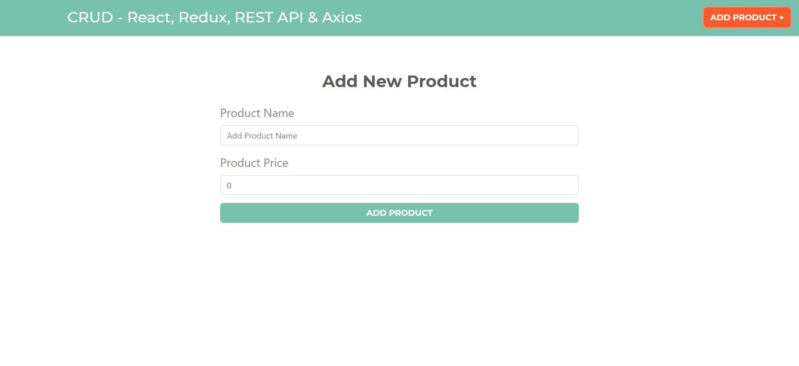
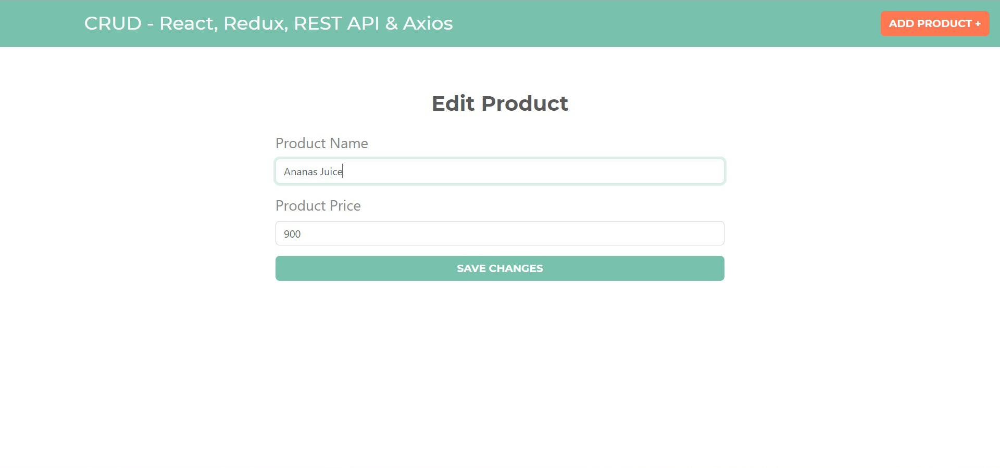
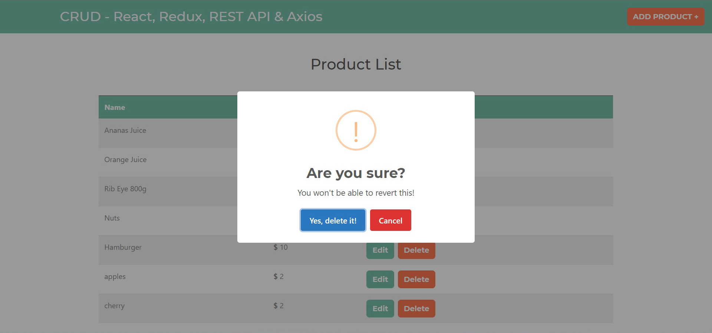
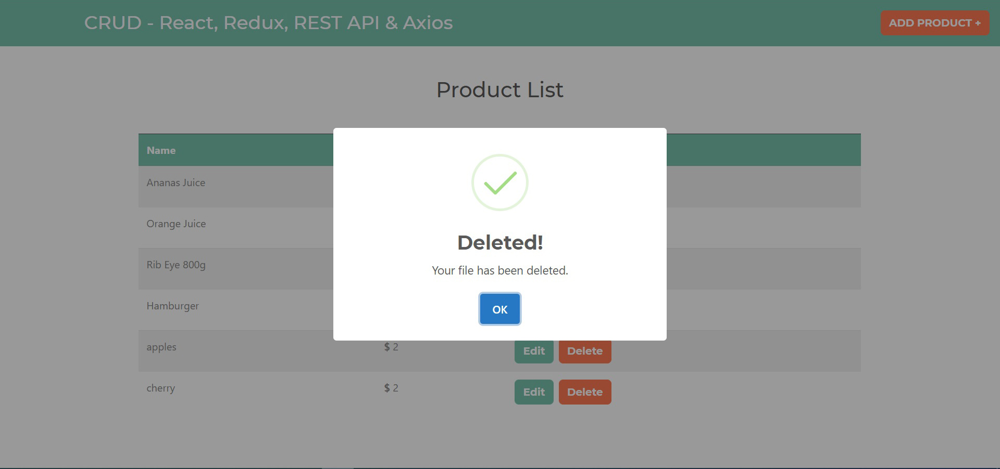

## CRUD Redux

An app which uses a CRUD and Redux to add products and price to list, also edit and delete products.

### Technologies

- React
- React router dom 
- React-redux redux redux-thunk
- Json-server 
- Axios
- CSS with Bootswatch
- SweetAlert2

### Views
- List View

- Add new product

- Edit product

- Delete alert

- Delete confirmation

